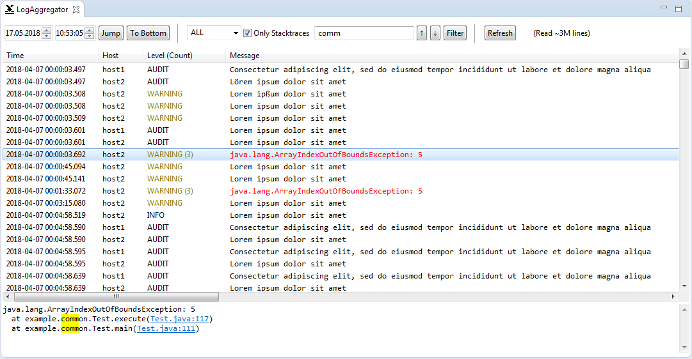

# LogAggregator

LogAggregator is an Eclipse Plugin that allows you to view a lot of separate log files in one unified, chronological view. It is particularly suited if you have got multiple different log files that partly contain identical entries and/or you have got similar types of log files from different locations e.g. from a distributed system with multiple hosts. It will also pull together rotated logs.



## Recent Changes (v2.0)

* Switch to editor workflow: Double click on a .logagg file to open it with LogAggregator (or use `Open with...`)
* Automatic creation of LogAggregator Config file based on a given directory (`File > New`)

## Install

Install and update this plugin directly from the p2 repository:
https://stc.nubenum.de/cdn/p2/

(You might need to untick the checkbox "Group items by category" in Eclipse's Install New Software Dialog.)

## Setup

After having installed the plugin, you can open it by double clicking on a `.logagg` configuration file in your Package Explorer (i.e. the plugin is an editor, even though it doesn't edit anything). You can create an example config file via `File > New > Other... > LogAggregator Config File` or manually by pasting the following snippet in a new text file with the `.logagg` extension. Opening this configuration file in the XML editor of your choice, you will have to indicate the log files you want to view. A LogAggregator config file might look like the following:
```
<?xml version="1.0" encoding="UTF-8" standalone="yes"?>

<aggregatorConfig>
	<!-- The location of the directory holding all log files. -->
	<location>C:/logs/</location>
	<hosts>
		<!-- Subdirectories that contain similar types of logs, e.g. the same logs from different hosts. -->
		<host>host1/</host>
		<!-- Define a short name to be displayed in the UI. -->
		<host shortName="alias">host2/</host>
	</hosts>
	<sources>
		<!-- Actual log files that are contained in each of the host directories. Files are matched using startsWith.
		Thus, the file extension can be omitted to fetch all matching rotated log files. -->
		<source>error</source>
		<!-- In case some logs are not available on all hosts, use the ignoreNotFound attribute. The default, if omitted, is false. -->
		<source ignoreNotFound="true">subdirectory/stdout</source>
		<source ignoreNotFound="false">access.</source>
	</sources>
</aggregatorConfig>

```
The above config could be suitable for the following directory structure:

* C:/logs/
	* host1/
		* error.log.5
		* error.log.6
		* error.log
		* subdirectory/
			* stdout.log
		* access.log.1
		* access.log
		* access_extended.log
	* host2/
		* error.log
		* access_18.01.01.log
		* access.log

Log files being matched using startsWith, there is one caveat: Different types of log files starting with the same name, in this case access_extended.log together with access.log, might be pulled in as one rotated log. The order of the files and thus the entire aggregation can be messed up by that. Look out for respective warnings in the Eclipse error log. Here, a dot (.) was appended for the access log in the config file to avoid this.

You can configure the behaviour of LogAggregator by adding the `options` Tag to you config file. Please see the javadoc for further info about the options.
```
<options enableMultithreading="true" enableFileWatcher="true" enableAutoClose="true">
    	<customLogTimeFormats>
    		<format>M/d/yy H:m:s.SSS zzz</format>
    	</customLogTimeFormats>
    </options>
```

## Usage
### List & Detail View
There are four columns in the list view:

* __Time.__ This will be highlighted red if badly ordered timestamps were detected and "spoofed". The tooltip will give you the raw timestamp and level as it was read from the file.
* __Host.__ The host from which the respective entry originates. The tooltip will give you the exact log file.
* __Level (Count).__ The log level of the entry, if available, and the amount of children this entry has (this can either be the number of lines for stacktraces or the number of duplicates for deduplicated entries). This will be highlighted red for ERROR and higher and yellowish for WARNING and higher.
* __Message.__ The log message. Stacktraces will be highlighted red.

Click on an entry to view the entire message below in the detail view.

### Jump & Search Menu
You can directly jump to the selected timestamp. Depending on the size of your log files, this might take some time.

From your current position, you can also search through the logs in two modes: Jump and Filter.

* __Jump (the up and down arrow buttons).__ Jump to the next or previous matching entry.
* __Filter.__ All non-matching entries will be hidden. If very few entries are matching, this might take a while or lead to problems. To remove the filter, click on the up or down buttons or remove all matching rules and click on "Filter" again.

You can match by:

* __Log Level.__ All higher levels will be matched.
* __Entry Type.__ Only Stacktraces are matched.
* __Message.__ The message search string can be a Java-esque regex and will match entries containing the pattern. If you want to match the entire message, use `^$`. If you want to match case insensitively, use the embedded flag `(?i)` (see documentation about Java regexes to learn more). Message pattern matches will be highlighted in the list and in the detail view.

After modifying the match rules, you need to click on the Filter or one of the arrow buttons to apply the rules. Tip: You can adapt the search pattern and click again on an entry to update the detail view highlighting without reapplying the filter or jumping.

---

This project was conceived at IT-Designers GmbH (www.it-designers.de)